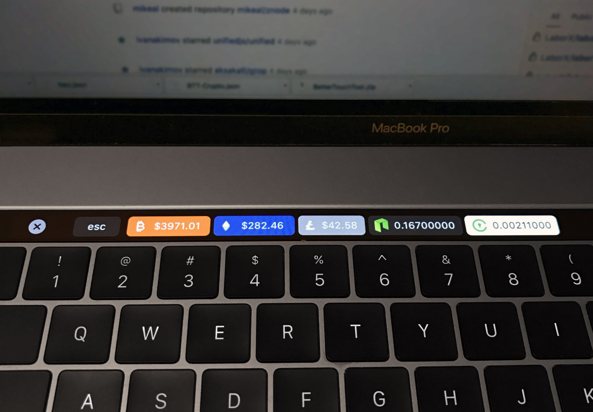

# mac-crypto-touch-bar
Crypto stock market prices for your Macbook Pro touch bar! Updated every minute.

### Video Tutorial For Install / Customization Coming Soon!

Coins / Tokens That Are Default To This Project:
- **Bitcoin** - Pulled from Coinbase.com API.
- **Ethereum** - Pulled from Coinbase.com API.
- **Litecoin** - Pulled from Coinbase.com API.
- **Neo** - Pulled from bittrex.com API.
- **BAT** - Pulled from bittrex.com API.
- **TenX** - Pulled from bittrex.com API.
- **OmiseGo** - Pulled from bittrex.com API.
- **Ripple** - Pulled from bittrex.com API.
- **Monaco** - Pulled from bittrex.com API.
- **QTUM** - Pulled from bittrex.com API.

# Notes:
- All values are in USD.
- For values taken from bittrex.com, the very last price this coin was sold for is used. Bonus feature: If you click the button it translates the current USD value to ETH.
- For **NEO**, **Civic**, **TenX** and any coin tracked on bittrex.com the USD price is calculated by the last sold ethereum-altcoin transaction multiplied by the current Coinbase value of Ethereum. For me, I felt like this was the most accurate representation rather than using USDT markets.
- Once installed, you can delete any coins you are not interested in tracking or add more coins by following the documentation below.

# To Install
1. Download and install [Better Touch Tool](https://www.boastr.net/downloads/). It allows you to modify your touch bar and other cool things. It's a 45-day trial but "pay what you like" to register.
2. In your Mac's menu bar, click the Better Touch Tool `icon > Preferences`.
3. In the bottom left corner of the popup go to `Manage Presets`.
4. Download this file (Right click on the link and download file.) - [Crypto.json](https://raw.githubusercontent.com/jakesorce/mac-crypto-touch-bar/master/Crypto.json)
5. Click the "Import" button and select the file you just downloaded.

# Customization
- Timing: Currently each currency is refreshed every 60 seconds. Change this by going to Better Touch Tool preferences panel, clicking on a currency, going to "advanced configuration", and adjusting the "run script every x seconds" amount. It's not recommended to go under 30 seconds or the server could ban you.
- Changing the logo of any coin: Download or make a .PNG version of the file. It's best if it has a clear background. In BetterTouchTool preferences go to the coin you want to change and drag your PNG file on to the old logo.
- Changing the background color of a logo: Same step as the previous line except you go to "Advanced Configuration" and edit "Touchbar button color".

# Troubleshooting or contact
Send me a message at jakesorce@gmail.com

# Donations
_I am not the original author of this script._ I found a quick and dirty version of it on steemit.com. I then improved, optimized, and extended it to support more cryptocurrencies and other features. The original idea came from [here](https://steemit.com/neo/@awesomemo/get-the-latest-price-of-neo-on-your-macbook-touchbar).  Still some people have mentioned wanting to donate so here's how if you like:

- Donate Bitcoin: 1PfHqrJYXdGUpsjTBA6UZMpxZAGS3HQTCi
- Donate Ethereum: 0x5f9C3cbe34E99Ca97506E4766b336338804F8916
- Donate Litecoin: LUdwuPA7Db4k7Q1nqenSVw6GhQxJrm5uRd
- Donate OMG: 0x5f9C3cbe34E99Ca97506E4766b336338804F8916
- Donate QTUM: 0x5f9C3cbe34E99Ca97506E4766b336338804F8916

# Acknowledgments
Thanks to the original source [here](https://steemit.com/neo/@awesomemo/get-the-latest-price-of-neo-on-your-macbook-touchbar) that my modified/optimized version is based on.
